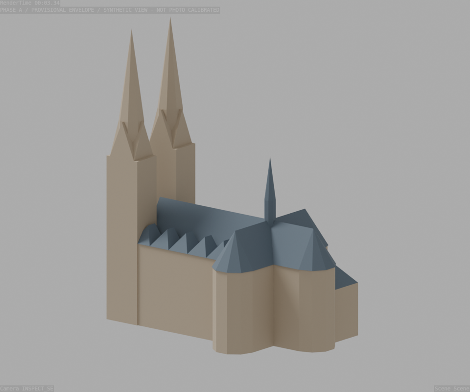

# Phase A 001 — erste Außenhülle

Datum: 2026-09-19. Status: **vorläufiges Grobmodell, keine Freigabe für Detailmodellierung**.



## Ergebnis und Reproduktion

Arbeitsdatei: `blender/scene/phase_a_001.blend`. Reproduzierbarer Generator:
`scripts/blender/20_exterior.py`, Parameter: `data/assumptions.yaml`, Maßanker:
`data/dimensions.yaml`. Der Host-Runner übergibt YAML als JSON an Blender.
Alle Modellparameter werden zusätzlich in der Szene gespeichert.

Enthalten: zusammenhängende Langhaus-/Dreikonchenhülle, zwei Westturmkerne mit
groben Giebelgeschossen und achteckigen Helmen, Hauptdächer, fünf niedrigere
Querdachmodule je Langhausseite, heutiger Dachreiter als Hülle sowie Sakristei.
Keine Innenarchitektur, Fenster, Strebepfeiler, Maßwerke oder Skulpturen.
Materialien und Beleuchtung dienen nur der Formprüfung.

```bash
python scripts/validate_dataset.py --assets
python scripts/run_blender.py build --output tmp/rebuilt_phase_a_001.blend
python scripts/run_blender.py inspect --scene tmp/rebuilt_phase_a_001.blend
python scripts/report_iteration.py
python -m unittest discover -s tests -v
```

## Evidenzprüfung

Alle 32 Commons-Dateien wurden erfolgreich mit akzeptierten Lizenzmetadaten
geladen; alle 22 Priority-1-Dateien sind lesbar. Metadaten und Hashes stehen im
versionierten `sources/reference_audit.json`. Die vollständigen Downloadprotokolle
und Binärreferenzen bleiben lokal. Frühere HTTP-429-Fehler bleiben im angehängten
Downloadbericht erhalten; der anschließende vollständige Lauf war erfolgreich.

Kontaktbögen overview/west/south/north/plans gesichtet, P01/P02/P06/P08 und
M01/M02/M05 zusätzlich einzeln geprüft. Moderne Referenzen tragen die äußere
Forminterpretation; historische Bilder liefern zusätzliche Silhouetten, keinen
Nachweis des aktuellen Restaurierungszustands. Die Fotoauswahl ist kein Aufmaß von 2026.

- M01: hilfreiche, aber nur 600 × 600 Pixel große Luftaufnahme; keine feine Dachmessung.
- M02–M07/M19: nachvollziehbare Langhaus-/Chorformen, teilweise durch Vegetation verdeckt.
- M08: weiterhin vom Pinhole-Solve ausgeschlossen.
- M09–M11: Turmgliederung und Westsilhouette; M09 ist eine Nahansicht mit starker Perspektive.
- M12/M13: Portal; für diese Iteration nicht modelliert.
- M14: zeigt den mittleren Westgiebel. Rolle im Manifest präzisiert; ursprünglicher
  Commons-Dateiname mit „Uhr“ und Quelldatei unverändert erhalten.
- M15–M18: Sakristei und Dachanschlüsse; geringe metrische Sicherheit ohne Kameralösung.
- H01–H05: historische Umfeld-/Silhouettenaufnahmen, H02/H03 sehr weit entfernt.
- P01–P08: historische Plan-, Schnitt-, Ansichts- und Detailblätter; P03/P04/P05
  nicht als metrische Grundlage dieser Iteration verwendet.

Die sechs vorhandenen Maßangaben wurden mit den verlinkten
[Kirchenangaben](https://www.elisabethkirche.de/kirchenraum/sehenswuerdiges/allgemeines)
und [Dehio](https://de.dehio.org/bauwerk/marburg-elisabethkirche) abgeglichen.
Innenmaße bleiben Innenmaße; die Turmhöhe von rund 80 m bleibt ein Näherungsanker.

## Grundriss und Zahlen

P01 wird über die klare Hallenbreite 21,55 m skaliert. Die manuell gesetzten
Bildpunkte und die Orientierung sind in `data/plan_calibration.yaml` dokumentiert:
Osten im Plan oben, Norden links, Ursprung im Vierungszentrum. Der historische
Fußmaßstab wird nicht ungeprüft in Meter umgerechnet. Die folgenden Zahlen sind
Ableitungen aus der Grafik, keine neuen dokumentierten Maße.

| Prüfung | Ergebnis | Einordnung |
|---|---:|---|
| Querhaus innen, unabhängiger Planabgleich | 39,08 m statt 39,00 m | +0,08 m / +0,21 %; innerhalb grober Ableseunsicherheit |
| Langhaus außen ohne Strebepfeiler | 24,00 m | vorläufige Hüllbreite |
| Mögliche innere Längsspanne | 57,45 m statt 56,00 m | +1,45 m / +2,59 %; Westhallengrenze unklar |
| Ostabschluss ab Vierung | Plan 20,92 m; Modellwand 20,51 m | Modell etwa 0,42 m kürzer; Symmetrisierung offen |
| Westabschluss ohne Ausladungen | Plan 46,02 m; Modell 46,00 m | vereinfachte Turmkerne |
| Modellhülle inklusive Dächer | 66,74 × 41,49 × 80,00 m | konstruierte Ausdehnung, kein vermessenes Kirchenmaß |

`plan_overlay.png` zeigt die Modellkonturen auf einer abgeleiteten Planansicht;
das Original bleibt unverändert. Die starke historische Links-/Rechtsdifferenz
im Strichbild wird nicht als pauschale reale Bauasymmetrie kopiert.

## Sichtprüfung und offene Diskrepanzen

Sechs feste INSPECT-Ansichten sind gerendert: W, N, S, NE, SE und Aufsicht.
Ihre Parameter und die begründete Bildausschnittkorrektur nach dem ersten Render
stehen in `validation/inspection_views.yaml`. Keine davon wurde an ein Foto gefittet.

| Ansichten / Evidenz | Bereits überprüfbar | Noch offen |
|---|---|---|
| SE/S — M02/M03/M05/M18/M19 | polygonaler Südchor, niedrigere Querbedachungen, Dachreiter, Zwillingstürme vorhanden | Trauf-/Firsthöhen nur geschätzt; fehlende Strebepfeiler verändern Außenkontur; Dachreiter noch geschlossen |
| N/NE — M01/M06/M07/M15–M17 | fünf Querdachmodule, Sakristei im Nordostwinkel | Sakristeiverbindung vereinfacht und ohne gelöstes Anschlussdach; Treppentürmchen fehlt |
| W — M09/M10/M11 | zwei schlanke achtseitige Helme, getrennte Turmkerne | Turmabsätze und Strebepfeiler fehlen; Mittelgiebel zu einfach; beide Turmspitzen symmetrisch auf 80 m |
| Aufsicht — P01 | Hallenbreite und drei polygonale Arme in plausibler Lage | Ostabschluss und Westwerk noch abweichend; Strebepfeiler bewusst ausgelassen |

Fluchtstruktur: Gegenüber P02/P08 stimmen die grundlegenden orthogonalen
Bauachsen und horizontalen Hauptfirste. Für die perspektivischen Fotos ist
die Fluchtpunkt-/Kamerakalibrierung noch nicht durchgeführt. Orthografische
Kontrollbilder erlauben daher keine Aussage über pixelgenaue Fotodeckung.
Silhouette-IoU und Reprojektionsfehler bleiben in den JSON-Berichten explizit `null`.

## Prüfungen und nächster Schritt

Datenprüfung einschließlich lokaler Priority-1-Bilder und Regressionstests bestanden.
Blender prüft tatsächliche Mesh-Ausdehnung, die 80-m-Bedingung, geschlossene
Einzelmeshes und vollständige Kamerabildausschnitte. Die Hauptmassen sind vereinigt;
Dächer und Turmgeschosse bleiben teilweise überlappende Einzelkörper. Damit ist
noch kein druckfertiger Gesamt-Solid oder überschneidungsfreier Export nachgewiesen.
Null Abweichung am vorgegebenen 80-m-Anker ist keine unabhängige Genauigkeitsprüfung.

Nächster Arbeitsschritt: Referenzkameras zuerst für M03 und M10/M11 kalibrieren,
Landmarken an Turm-/Chor-/Traufpunkten erfassen, Längsgrenze und Höhenansätze
nachprüfen. Anschließend erst Strebepfeiler und Öffnungen. Fehlende direkte moderne
Ostansichten und schwache Dachauflösung begrenzen weiterhin die Genauigkeit.

Issue-Bezug: #2/#3 in dieser Iteration bearbeitet; #4–#6 als vorläufiger Modellstand;
#8 als erster wiederholbarer Bericht. #7 und die Freigabe der Grobgeometrie stehen aus.
GitHub-Issues wurden nicht automatisch geschlossen.
