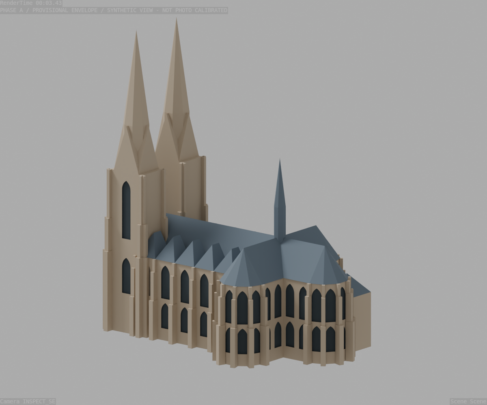

# Phase A 002 — strukturelle Außenhülle, noch nicht abgenommen

Stand: 2026-09-21. Arbeitsdatei: `blender/scene/phase_a_002.blend`.
Phase A 001 bleibt unverändert; ihre Parameter sind unter
`data/iterations/phase_a_001_assumptions.yaml` archiviert.

## Umsetzung

- Prozedurale dreistufige Strebepfeiler an Langhaus, Konchen und Türmen.
- Zweigeschossige Spitzbogenfenster als echte, blind hinterlegte Außenvertiefungen.
- Provisorische Turmöffnungen, Westportal und Westfenster. Kein Innenraum.
- Vier modellabhängig geschätzte Fotokameras für M02, M03, M10 und M11.
- Explizite Bildbeobachtungen, Kameraversuche, Höhenvorschlag und Annahmenhistorie.

Die aus M03/M10/M11 geschätzten Höhen sind **keine gemessenen Maße**:
Traufe 21,24 m, Hauptfirst 29,93 m, Turmschaft 42,78 m, Dachreiter 50,99 m.
Der 80-m-Turmanker ist eine Konstruktionsvorgabe, kein Genauigkeitsnachweis.
Alle ursprünglichen Referenzbilder bleiben unverändert.

## Prüfung

242 geschlossene Einzelmeshes, keine nicht-mannigfaltigen Einzelobjekte.
Gesamthülle einschließlich Strebepfeilern: etwa 70,61 × 45,22 × 80,00 m.
Das ist nicht mit dokumentierten lichten Innenmaßen gleichzusetzen.
Separate Bauteile können sich konstruktiv überschneiden; kein vereinigtes Druckmodell.
Blender-Kameraprojektionen stimmen mit dem numerischen Solver auf unter 0,05 Pixel überein.
Dies prüft die Implementierung, nicht die fotografische Passung.
Dataset-/Asset-Prüfung und alle acht Python-Tests erfolgreich.

| Foto | Fit-RMSE (Pixel) | Check-RMSE (Pixel) |
| --- | ---: | ---: |
| M02 | 16,74 | 15,07 |
| M03 | 8,67 | 2,87 |
| M10 | 10,33 | 11,96 |
| M11 | 10,11 | 17,57 |

Die Check-Punkte von M03/M10/M11 wurden teilweise zur Höheninferenz verwendet
und sind daher **nicht unabhängig**. M02 war von der Höheninferenz ausgeschlossen,
seine Kamera wurde aber ebenfalls angepasst. Keine metrische Genauigkeit daraus ableiten.
Die angenommene Kamerahöhe 1,7 m fixiert einen Freiheitsgrad; sie ist nicht belegt.
Bildverschiebung und Neigung sind Hypothesen ohne nachgewiesene Sensordaten.
Die Entwicklung dieser Hypothesen ist in `validation/photo_landmarks.yaml` dokumentiert.
Der Annahmen-Hash im eingefrorenen Kamerabericht bezeichnet den Stand vor Ergänzung
der Strebepfeiler-/Fensterparameter. Danach wurden die Kameras nicht mehr angepasst.

Fotoprojektionen: `validation/renders/phase_a_002/Mxx_overlay.png`.
Orange zeigt die Modellhülle; Bäume, Fahrzeuge und andere Verdeckungen sind nicht maskiert.
Synthetische Kontrollansichten: `INSPECT_*.png` im selben Verzeichnis.

## Visuell festgestellte Abweichungen / nächste Arbeiten

1. M11: äußere Turmstrebepfeiler und untere Turmstaffelung zu schmal; Silhouette
   links weicht sichtbar ab. Turmpfeiler müssen unabhängig von Chorpfeilern parametrisiert werden.
2. M03: Dachreiterabschluss, Dachübergänge und Sakristeikontur vereinfacht.
3. Sakristei noch ohne Fenster; Ost-/Innenseiten der Türme nicht vollständig durchgebildet.
4. Fensterbreiten und Spitzbogenform sind vorläufig; schmale Anschlussfelder werden
   aus verfügbarer Wandbreite minus Pfeilerbreite abgeleitet, nicht vermessen.
5. Turmgiebelöffnungen, Fialen, Gesimse, Maßwerk, Portalskulptur und Oberflächen fehlen.
6. Nord-, Süd- und Südwest-Fotokameras sowie unabhängige Silhouettenmetriken fehlen.
7. Die Unsicherheit der Längenkalibrierung aus Phase A 001 bleibt bestehen.

**Silhouettenfreigabe nicht erteilt.** Dekorative Modellierung bleibt gemäß AGENTS.md
zurückgestellt. Dieses Ergebnis ist eine überprüfbare Zwischenfassung, kein abgeschlossener Job.
