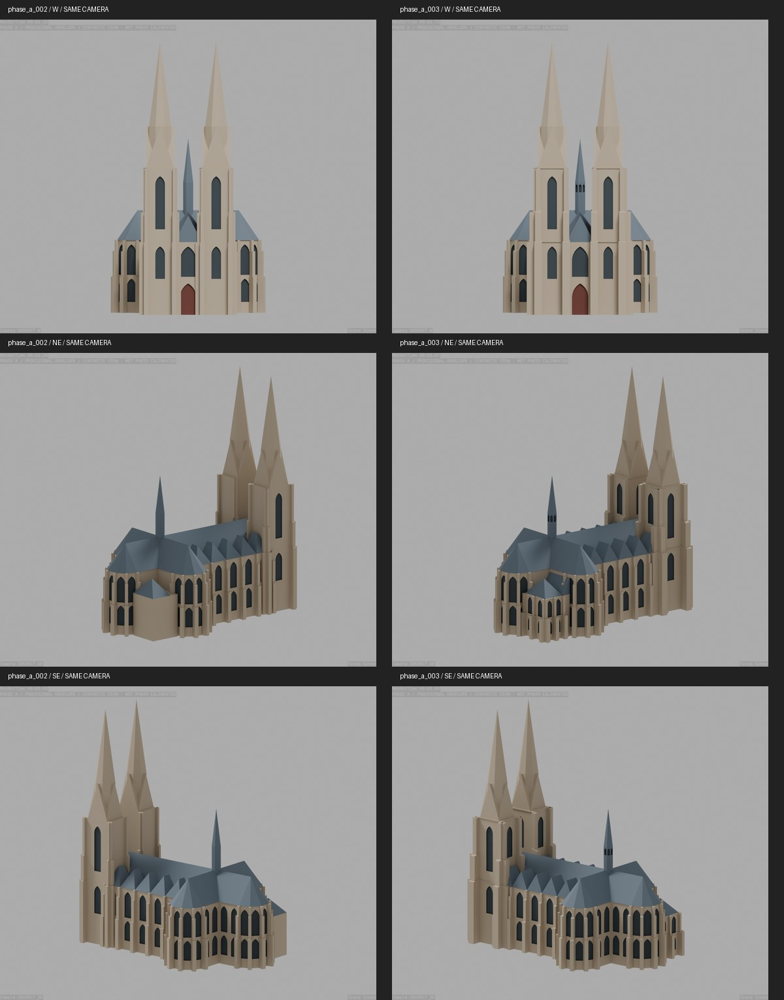

# PR 1 — Außenform und Wiedererkennung

Stand: 2026-09-23. Teil von Tracking-Issue #9, nicht Abschluss des Gesamtprojekts.
Arbeitsdatei: `blender/scene/phase_a_003.blend` (Blender 5.2.1).



## Änderungen

- Projektvorgaben auf optische Plausibilität, späteres texturiertes Sichtmodell und
  separate Tastversion ausgerichtet. Keine neue Kamerakalibrierung als Abschlussbedingung.
- Turmstrebepfeiler unabhängig von den Chorpfeilern verbreitert und kräftiger gestaffelt.
  Nach innen gerichtete Pfeilervorsprünge entfallen, damit das Westportal frei bleibt.
- Schräge Abdeckungen an den Pfeilerabsätzen statt ausschließlich flacher Stufen.
- Strukturelle Bänder an Turmtraufe und Schaftabschluss; keine durch die hohen Fenster
  laufenden Bänder. Zusätzliche Öffnungen an sichtbaren Ost-/Innenseiten der Türme.
- Vollere seitliche Walmdächer: äußerer Firstabschluss näher zur Traufe.
- Sakristei mit zwei Fensterregistern, Pfeilern, Geschossbändern und geschlossenem
  Dachanschluss statt ungegliederter Box mit offen wirkendem Anschluss.
- Dunkle, blind hinterlegte Laternenöffnungen am modernen Dachreiter.

Alle neuen Maße sind explizite visuelle Annahmen, keine Vermessung. Achsen, Ursprung,
80-m-Anker, Hauptproportionen und Referenzdateien bleiben unverändert. Der Parameterstand
002 liegt in `data/iterations/phase_a_002_assumptions.yaml`; bisherige Blender-Dateien bleiben erhalten.

## Qualitative Prüfung

| Gegenstand | Evidenz / Ansicht | Ergebnis und Grenze |
| --- | --- | --- |
| Westtürme | M10/M11, INSPECT_W | Kräftigere Basis und Staffelung; Portal bleibt frei. Fialen und obere Giebelöffnungen fehlen noch. |
| Dächer | M01, INSPECT_NE/SE | Seitliche Dachkörper voller und Rhythmus deutlicher; Hauptfirst und Konchen unverändert. |
| Sakristei | M16, INSPECT_NE | Zweigeschossige Gliederung wiedererkennbar; Fenstermaßwerk und genaue Pfeilerprofile fehlen. |
| Dachreiter | M03/M16 | Laterne ablesbar statt durchgehend geschlossenem Schaft; bewusst keine Innenkonstruktion. |

Sechs synthetische Ansichten und vier Projektionen mit den **unveränderten** Fotokameras
aus 002 wurden gerendert. M11 zeigt weiterhin lokale Konturabweichungen, insbesondere
an den noch fehlenden Fialen. Kamera-Fit, Vegetation und Verdeckungen begrenzen den
Vergleich. Keine neue quantitative Genauigkeit oder vollständige Silhouettenübereinstimmung behauptet.

Die Grundformen sind als Arbeitsbasis für PR 2 visuell plausibilisiert, nicht als
fertiges Sichtmodell abgenommen. Oberer Turmabschluss bleibt grob; in PR 2 folgen
prägende Giebelöffnungen/Fialen, Maßwerk, Portaldetails, Materialien und Texturen.
Sakristei-Anschluss, Gesimsprofile und kleine Asymmetrien bleiben vereinfachte Annäherungen.

## Technische Prüfung und Reproduktion

- Dataset-/Asset-Prüfung erfolgreich; acht Python-Tests erfolgreich.
- Build prüft geschlossene Einzelmeshes, Maßanker und vollständige Bildausschnitte.
- Separater Blender-Regressionstest prüft endliche Koordinaten, geschlossene Volumina,
  vorhandene Parameter-IDs, acht Sakristeifenster, acht Laternenöffnungen und freies Westportal.
- Kameraprojektion im Blender-Import stimmt weiterhin auf unter 0,05 Pixel mit dem
  eingefrorenen Solver überein (Implementierungsprüfung, kein Genauigkeitsnachweis).
- Einzelbauteile überlappen teilweise. Noch keine vereinigte, druckgeprüfte Geometrie.

Mit vorhandenen Referenzbildern, `requirements.txt` und Blender; Ausgabepfade müssen neu sein:

```powershell
python scripts/run_blender.py build --structure --iteration phase_a_003 --output tmp/rebuild_003.blend
python scripts/run_blender.py calibrate --scene tmp/rebuild_003.blend --iteration phase_a_003 --cameras validation/reports/phase_a_002/camera_solutions.json --output tmp/rebuild_003_cameras.blend
python scripts/run_blender.py verify-form --scene tmp/rebuild_003_cameras.blend
python scripts/run_blender.py inspect --scene tmp/rebuild_003.blend
python scripts/run_blender.py render --scene tmp/rebuild_003_cameras.blend
python scripts/prepare_calibration_views.py
python scripts/photo_overlays.py phase_a_003
python scripts/compare_form_iterations.py
```

Für die Vergleichstafel müssen auch die synthetischen 002-Render vorliegen. Bei Bedarf:
`python scripts/run_blender.py inspect --scene blender/scene/phase_a_002.blend`.
Beide Szenen verwenden identische synthetische Kameras; beim nachträglichen Rendern der
kalibrierten 002-Datei deren ursprüngliche Inspektionsauflösung verwenden (siehe nächster Absatz).

`inspect` setzt die feste Auflösung aus `validation/inspection_views.yaml` und einen
undurchsichtigen Hintergrund, unabhängig von zuvor importierten Fotokameras.
Referenz-Overlays bleiben lokale Diagnosebilder unter `validation/renders/phase_a_003/`.

## Noch nicht enthalten

Keine Texturen, druckfähige Vereinigung, Mindeststärkenprüfung oder physische Tastprobe.
Für PR 3 werden Druckverfahren/Material und das 20-cm-Zielmaß bestätigt. Texturen
ersetzen keine ertastbaren Merkmale; diese werden dort als robuste Geometrie abgeleitet.
