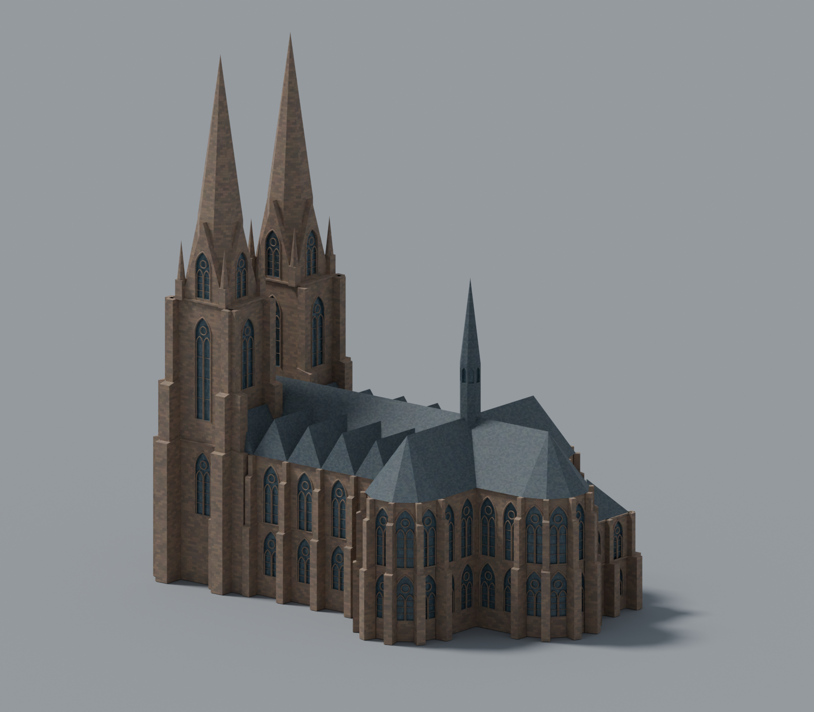
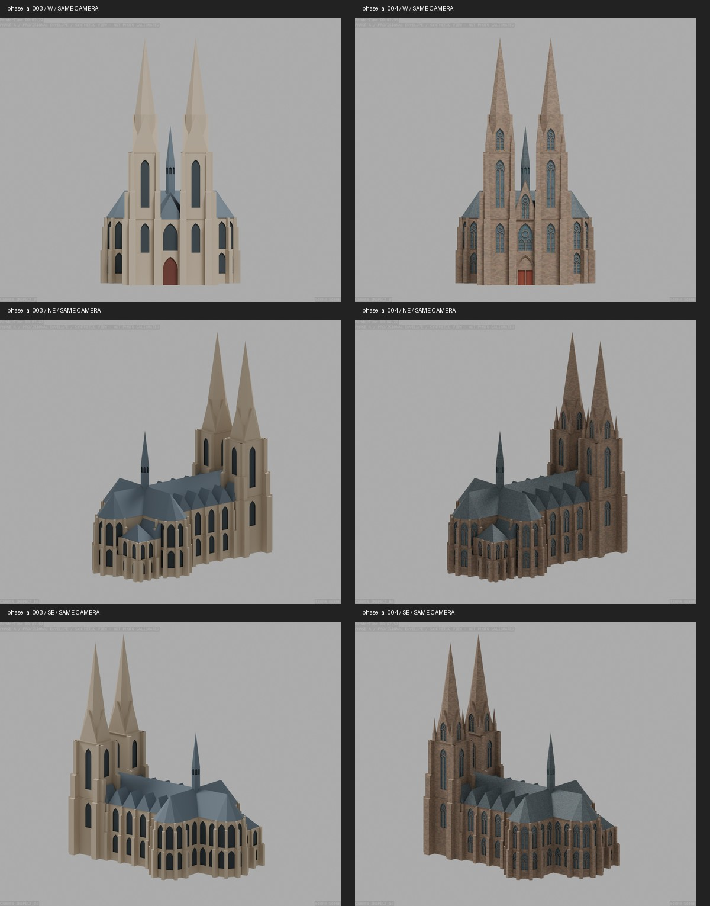

# PR 2 — Außendetails und texturiertes Sichtmodell

Teil von Tracking-Issue #9, 2026-09-23. PR 1 (#10) ist gemergt.
Neue Arbeitsdatei: `blender/scene/phase_a_004.blend`.



## Enthalten

- Vereinfachte zweibahnige Spitzbogenfenster mit runder Maßwerköffnung, Querstreben
  und erhabenen Steinrahmen an Langhaus, Konchen, Sakristei und Türmen.
- Acht obere Turmgiebelöffnungen und acht schlanke Eckfialen.
- Profilierte Portalrahmung, rotes Doppeltor, Mittelstütze, Sturz und vereinfachtes Tympanon.
- Zentraler steinerner Uhrengiebel mit Öffnung, Uhrenring, Markierungen und statischen Zeigern.
- Einfache horizontale Gesimslinien an Langhaus und Konchen.
- Seitendachfirste bis zum rechnerischen Schnitt mit der Hauptdachfläche verlängert;
  keine frei stehenden inneren Dreiecksstirnen mehr. Bestehende Höhen bleiben unverändert.
- Vier selbstständige prozedurale Texturmaterialien: Sandstein, Schiefer, Glas, rote Türen.
  Details und Herkunft: [Materialdokumentation](../materials.md).



## Sichtprüfung und Vereinfachungen

M12/M14/M19 wurden für Portal, Uhrengiebel und Fenstercharakter herangezogen; M11/M16
bleiben die Referenzen für Turmstaffelung und Sakristei. Die neue Silhouette ergänzt
die zuvor fehlenden Fialen, ohne Maßanker oder Fotokameras zu verändern.
Die homogenen Wandflächen sind jetzt gegliedert; Materialfarben und Fugen sind auch
in Nahansichten sichtbar. Der erste Uhrengiebel hatte einen Konflikt mit dem geschlossenen
Dachabschluss; sein Aufbau wurde nach vorne versetzt und die freie Lage der Verglasung
durch einen Regressionstest abgesichert.

Bewusste Grenzen: kein photorealistischer Scan, keine exakte individuelle Maßwerkkopie.
Sakristei-Dreipässe werden durch runde Motive angenähert. Figuren-/Laubskulptur des
Portals, Fialenkrabben, Wasserspeier und kleine Dachaufbauten sind nicht vollständig
nachgebildet. Das Tympanon ist eine vereinfachte Steinfläche. Die Uhr besitzt abstrakte
Markierungen statt originaler römischer Ziffern; Zeigerstellung ist dekorativ.
Die Texturen reproduzieren Materialcharakter, nicht den belegten Zustand jedes Steins.
Lokale Proportions-/Konturabweichungen aus den bisherigen Iterationen bleiben dokumentierte
Annäherungen. Keine neue Vermessungsgenauigkeit wird behauptet.

## Prüfung

- Dataset und Assets validiert; elf Python-Tests bestanden.
- Blender-Build prüft geschlossene Einzelmeshes, 80-m-Anker und synthetische Bildausschnitte.
- `verify-form` prüft Volumina, endliche Koordinaten/UVs, Parameter-IDs, Fenster/Fialenzahlen,
  freies Portal, Uhrenglas vor dem Dachabschluss und vier eingebettete Texturrezepte.
- Sechs unveränderte synthetische Ansichten und vier vorhandene Fotoprojektionen gerendert.
- Separate Gesamt-/Nahansichten mit Studioboden; keine Änderung der Validierungskameras.
- Historische Arbeitsdateien unverändert; Parameterstand 003 archiviert.

## Reproduktion

Neue Ausgabepfade wählen; Blender 5.2.1, Python und `requirements.txt`, Referenzen lokal vorhanden:

```powershell
python scripts/run_blender.py build --structure --iteration phase_a_004 --output tmp/rebuild_004.blend
python scripts/run_blender.py calibrate --scene tmp/rebuild_004.blend --iteration phase_a_004 --cameras validation/reports/phase_a_002/camera_solutions.json --output tmp/rebuild_004_cameras.blend
python scripts/run_blender.py verify-form --scene tmp/rebuild_004_cameras.blend
python scripts/run_blender.py inspect --scene tmp/rebuild_004_cameras.blend
python scripts/run_blender.py render --scene tmp/rebuild_004_cameras.blend
python scripts/run_blender.py present --scene tmp/rebuild_004_cameras.blend
python scripts/prepare_calibration_views.py
python scripts/photo_overlays.py phase_a_004
python scripts/compare_form_iterations.py --before phase_a_003 --after phase_a_004
```

Für die Vergleichstafel gegebenenfalls zuvor 003 mit `inspect` rendern.
Die Dateien unter `validation/renders/phase_a_004/` enthalten sämtliche Kontroll- und
Präsentationsbilder. Die versionierten Vorschaubilder sind Kopien der Renderausgaben.

## Nächste Stufe

Noch **keine Druckvorlage**: Komponenten überlappen, dünnes Maßwerk/Fialen sind nicht
auf 20-cm-Druckstärken ausgelegt. PR 3 benötigt Druckverfahren, Material und Bestätigung
des Zielmaßes. Dort folgen robuste Vereinfachung, Vereinigung, Slicerprüfung und Export.
Die spätere physische Testdruck-/Tastabnahme ist nicht durch diese Sichtprüfung ersetzt.
